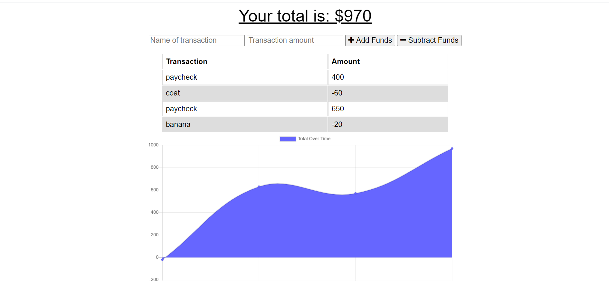

# PWA Budget Tracker

## Description

Budget Tracker is an application that will help the user keep up with expenses. They can add funds, for any money aquired, or subtract, depending on purchases. A line graph is created, based on the data, that will illustrate spending and gaining patterns. The best feature is that the Budget Tracker can also be used offline. Data can still be gathered, but will not populate until the user is back online.

## Installation

Budget Tracker is installed by first cloning the repo from [Edibozu](https://github.com/Edibozu/pwa-budget-tracker). Once cloned, the code can be viewed in VS Code. The application itself is deployed on [Heroku](https://pwa-budget-tracker-ep.herokuapp.com/).
  
Here we have the Budget Tracker. It's simple design makes it easy for anyone to use. Data has been collected and shows an example of how its displayed, with a table and a line graph 
  

   

## Questions

For any questions, contact me on any of the following links:

Email: edibozu@gmail.com

Heroku: https://pwa-budget-tracker-ep.herokuapp.com/

GitHub Repo: https://github.com/Edibozu/pwa-budget-tracker

LinkedIn: https://www.linkedin.com/in/eduardo-pineda-5595431b6/

## Contributions

This application was aided by my fellow classmates during our after class study sessions.

## License

MIT License

Copyright (c) [2020] [Eduardo Pineda]

Permission is hereby granted, free of charge, to any person obtaining a copy
of this software and associated documentation files (the "Software"), to deal
in the Software without restriction, including without limitation the rights
to use, copy, modify, merge, publish, distribute, sublicense, and/or sell
copies of the Software, and to permit persons to whom the Software is
furnished to do so, subject to the following conditions:

The above copyright notice and this permission notice shall be included in all
copies or substantial portions of the Software.

THE SOFTWARE IS PROVIDED "AS IS", WITHOUT WARRANTY OF ANY KIND, EXPRESS OR
IMPLIED, INCLUDING BUT NOT LIMITED TO THE WARRANTIES OF MERCHANTABILITY,
FITNESS FOR A PARTICULAR PURPOSE AND NONINFRINGEMENT. IN NO EVENT SHALL THE
AUTHORS OR COPYRIGHT HOLDERS BE LIABLE FOR ANY CLAIM, DAMAGES OR OTHER
LIABILITY, WHETHER IN AN ACTION OF CONTRACT, TORT OR OTHERWISE, ARISING FROM,
OUT OF OR IN CONNECTION WITH THE SOFTWARE OR THE USE OR OTHER DEALINGS IN THE
SOFTWARE.
